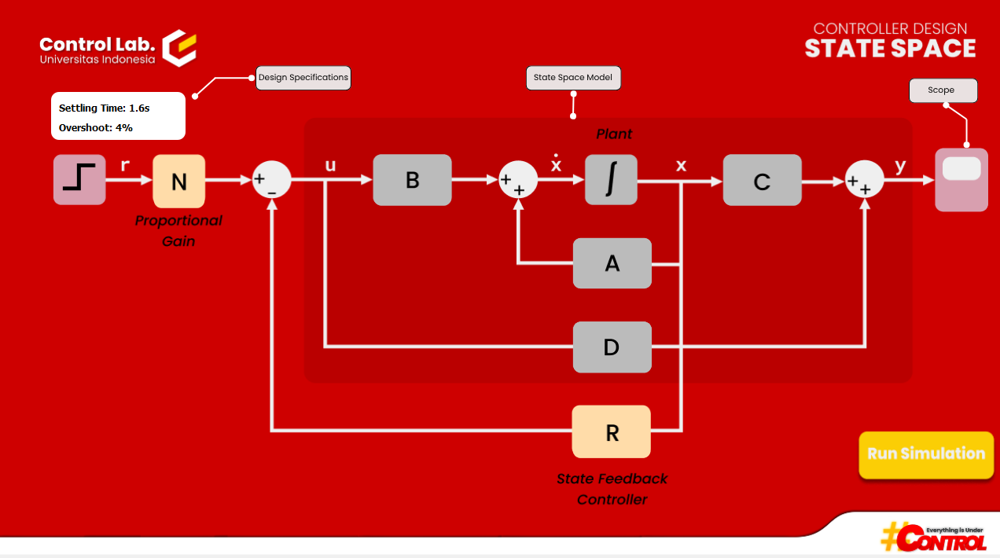

# State-Space Controller Design

An educational desktop application for practicing state-space controller design through problem solving and simulation.

## Overview

**State-Space Controller Design** is a desktop application developed with Python, PyQt5, and Python Control Systems to help students practice designing state-space controllers.

The application assigns each student a problem set containing the **state-space model of a system** and the **desired specifications for the final controlled system**. Based on these specifications, students are required to design a **state-feedback controller** and a **proportional gain**.

Students can then observe how each stage of the controller design changes the system response. The application allows them to visualize the response of:

1. The **original system**, before any controller is added.
2. The system **with the state-feedback controller**.
3. The system **with the state-feedback controller and proportional gain**.

By comparing these responses, students can observe the effect of adding state feedback and subsequently adding proportional gain, and understand how controller design changes the behavior of the system to meet the desired specifications.

After completing the exercise, the application evaluates the student's controller design, calculates a score, and stores the results in a Firebase database for later collection by an administrator.

## Features

### Problem Assignment

* Assigns a problem set to the student.
* Each student works on one assigned problem set.
* The assigned system provides the specifications required for the controller-design exercise.

### State-Feedback Controller Design

Students calculate and enter the required state-feedback controller for their assigned system.

### Proportional Gain Design

Students calculate and enter the proportional gain required for the control system.

### System Response Simulation

The application allows students to compare the system response under three configurations:

1. **Without state-feedback control**
2. **With state-feedback control**
3. **With state-feedback control + proportional gain**

This allows students to observe the effect of the controller design on the system response.

### Automatic Assessment

After the student completes the exercise, the application automatically evaluates the submitted controller parameters and calculates a score.

### Result Collection

Student results and scores are stored in a **Firebase Realtime Database**, allowing an administrator to collect the results from multiple students.

## Application Walkthrough

This walkthrough demonstrates how to use the application and guides you through the main features.

### 1. Login Page


Students can log in to the application using their **Student ID**. The application verifies the entered ID with the student information stored in the database.

### 2. Main Page

After logging in, the student is presented with the main page containing the state-space model of their assigned system, the controller-design specifications, and the simulation controls.



The main page displays a block diagram showing the **original system** and the application of the **state-feedback controller** and **proportional gain**.

The following features are available on this page:

* **State-Space Model** — Displays the system matrices **A**, **B**, **C**, and **D**. Each matrix can be clicked to view its values.
* **Design Specifications** — Displays the desired specifications that the student must achieve when designing the controller. These specifications are shown in the white box in the top left.
* **Run Simulation** — Runs the simulation using the current controller configuration and saves the resulting values for the assessment.
* **Scope** — Opens the system-response visualization, allowing the student to observe the behavior of the system.

## Installation

### Requirements

* Operating System: Windows
* Python: 3.10+

### 1. Clone the Repository

```bash
git clone https://github.com/pnabilah/State-Space-Controller.git
```

### 2. Create a Virtual Environment

```bash
python -m venv .venv
```

Activate the environment on Windows:

```powershell
.venv\Scripts\Activate.ps1
```

### 3. Install Dependencies

```bash
pip install -r requirements.txt
```

## Configuration

The application uses an environment variable for the Firebase database configuration.

Create a `.env` file in the project root:

```env
FIREBASE_BASE_URL=your_firebase_database_url
```

## Running the Application

After activating the virtual environment and installing the required dependencies:

```bash
python main.py
```

## License

This project is licensed under the MIT License. See the [LICENSE](LICENSE) file for details.

